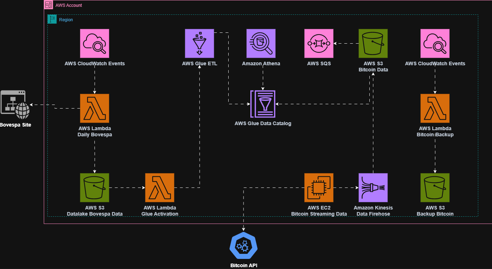

# 📊 Documentação de Finalização - Tech Challenge Bovespa Data Pipeline

## 🎯 Visão Geral do Projeto

Este projeto foi desenvolvido como solução para o Tech Challenge da FIAP, implementando um pipeline completo de dados para extração, processamento e análise de dados do pregão da B3 (Bovespa). A solução atende todos os requisitos obrigatórios do desafio, além de implementar funcionalidades adicionais de streaming de dados de Bitcoin.

## 🏗️ Arquitetura da Solução

A arquitetura implementada segue as melhores práticas de engenharia de dados na AWS, utilizando serviços gerenciados para garantir escalabilidade, confiabilidade e eficiência operacional.

## 🔧 Estratégias Técnicas Implementadas

### 1. Infrastructure as Code (IaC) com Terraform

**Estratégia Adotada**: Utilização do Terraform para provisionamento completo da infraestrutura AWS.

**Benefícios Alcançados**:
- **Reprodutibilidade**: Toda a infraestrutura pode ser recriada de forma consistente
- **Versionamento**: Controle de versão das mudanças de infraestrutura
- **Modularização**: Código organizado em módulos reutilizáveis (S3, Lambda, Glue, IAM, etc.)
- **Gestão de Estado**: Estado centralizado no S3 para colaboração em equipe

**Implementação**: A estrutura modular permite fácil manutenção e extensão, com cada serviço AWS encapsulado em seu próprio módulo.

### 2. Containerização com Docker e ECR

**Estratégia Adotada**: Uso de imagens Docker customizadas hospedadas no Amazon ECR para as funções Lambda.

**Benefícios Alcançados**:
- **Dependências Complexas**: Suporte a bibliotecas Python pesadas (pandas, requests, boto3)
- **Controle de Ambiente**: Ambiente de execução consistente e controlado
- **Flexibilidade**: Capacidade de incluir dependências específicas não disponíveis nas layers padrão
- **Versionamento**: Controle de versões das imagens através de tags

**Implementação**: Duas imagens Docker distintas foram criadas:
- `lambda-libs`: Para o scraping diário da Bovespa
- `lambda-bitcoin-libs`: Para backup assíncrono de dados Bitcoin

### 3. Pipeline Batch para Dados da Bovespa

**Estratégia Adotada**: Implementação de um pipeline ETL completo e automatizado.

**Fluxo Implementado**:
1. **Extração**: Lambda executa scraping diário dos dados da B3
2. **Armazenamento Raw**: Dados salvos em formato Parquet no S3 com particionamento diário
3. **Trigger Automático**: S3 aciona Lambda que inicia job do Glue
4. **Transformação**: Glue processa dados com agregações e cálculos de data
5. **Armazenamento Refinado**: Dados processados salvos particionados por data e ação
6. **Catalogação**: Glue Catalog automaticamente registra metadados
7. **Consulta**: Dados disponíveis no Athena para análise

**Transformações Implementadas**:
- Agrupamento por ação, data e tipo com sumarização de quantidade teórica
- Renomeação de colunas (`acao` → `action`, `data_pregao` → `pregao_date`)
- Cálculo de diferença entre data atual e data do pregão

### 4. Streaming de Dados Bitcoin (Funcionalidade Adicional)

**Estratégia Adotada**: Pipeline de streaming em tempo real usando EC2 e Kinesis Firehose.

**Implementação**:
- **EC2**: Instância executando script Python contínuo para coleta de dados
- **Kinesis Firehose**: Stream de dados em tempo real para S3
- **Backup Assíncrono**: Lambda processa filas SQS para backup paralelo
- **Processamento Concorrente**: Uso de ThreadPoolExecutor para otimização

### 5. Gerenciamento de Permissões e Segurança

**Estratégia Adotada**: Implementação do princípio de menor privilégio com IAM roles específicas.

**Roles Criadas**:
- Role para Lambda de scraping da Bovespa
- Role para Lambda de ativação do Glue
- Role para jobs do Glue
- Role para instância EC2
- Role para Kinesis Firehose
- Role para Lambda de backup Bitcoin

**Benefícios**: Cada componente possui apenas as permissões necessárias para sua função específica.

### 6. Monitoramento e Observabilidade

**Estratégia Adotada**: Uso do CloudWatch para agendamento e monitoramento.

**Implementação**:
- **EventBridge Rules**: Agendamento automático das execuções
- **Logs Centralizados**: Todos os componentes enviam logs para CloudWatch
- **Métricas**: Acompanhamento de performance e erros

### 7. Otimizações de Performance

**Estratégias Implementadas**:
- **Formato Parquet**: Armazenamento colunar otimizado para consultas analíticas
- **Particionamento**: Dados particionados por data e ação para consultas eficientes
- **Compressão Snappy**: Redução do tamanho dos arquivos
- **Processamento Paralelo**: Uso de threads para backup assíncrono

## 📋 Requisitos Atendidos

### ✅ Pipeline Batch Bovespa (Obrigatório)

1. **Scraping de Dados**: Lambda realiza scraping diário do site da B3
2. **Ingestão S3**: Dados armazenados em Parquet com partição diária
3. **Trigger Lambda**: S3 aciona Lambda que inicia job Glue
4. **Lambda de Ativação**: Função dedicada para iniciar jobs Glue
5. **Job Glue Visual**: Transformações implementadas no modo visual:
   - Agrupamento e sumarização de quantidade teórica
   - Renomeação de colunas (acao → action, data_pregao → pregao_date)
   - Cálculo de diferença entre datas
6. **Dados Refinados**: Salvos em formato Parquet particionados por data e ação
7. **Catalogação Automática**: Glue Catalog registra automaticamente os metadados
8. **Disponibilidade Athena**: Dados consultáveis via Athena
9. **Visualização**: Workbook Athena configurado para análises gráficas

### ✅ Pipeline Stream Bitcoin (Opcional)

- **Coleta Contínua**: EC2 coletando dados de API Bitcoin a cada 60 segundos
- **Streaming**: Kinesis Firehose enviando dados para S3 em tempo real
- **Backup Assíncrono**: Sistema de backup paralelo com processamento em lotes
- **Tolerância a Falhas**: Tratamento de erros e retry automático

## 🚀 Diferenciais da Solução

1. **Automação Completa**: Pipeline totalmente automatizado do início ao fim
2. **Escalabilidade**: Arquitetura serverless que escala automaticamente
3. **Observabilidade**: Logs e métricas centralizados para monitoramento
4. **Flexibilidade**: Código modular e facilmente extensível
5. **Eficiência**: Uso de formatos otimizados e processamento paralelo
6. **Segurança**: Implementação de melhores práticas de segurança AWS

## 📊 Resultados Obtidos

- **Pipeline Funcional**: Sistema completo de ETL operacional
- **Dados Disponíveis**: Informações da Bovespa acessíveis via Athena
- **Streaming Implementado**: Dados Bitcoin coletados em tempo real
- **Infraestrutura Reproduzível**: Ambiente completamente automatizado
- **Monitoramento Ativo**: Visibilidade completa das operações

## 🎯 Conclusão

A solução desenvolvida atende integralmente aos requisitos do Tech Challenge, implementando um pipeline robusto e escalável para processamento de dados financeiros. A combinação de tecnologias AWS, práticas de IaC e arquitetura serverless resulta em uma solução moderna, eficiente e de fácil manutenção.

O projeto demonstra domínio das principais ferramentas de engenharia de dados na nuvem, desde a coleta até a disponibilização dos dados para análise, seguindo as melhores práticas da indústria.
