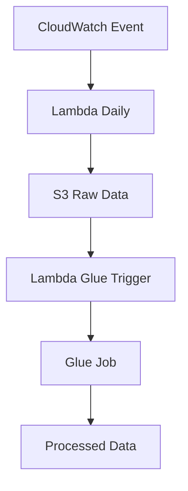

# 📊 Bovespa Data Batch Pipeline

Pipeline de dados em lote para coleta e processamento de dados da Bovespa usando AWS (Lambda, Glue, S3 e CloudWatch).

## 📋 Guia de Instalação e Execução (Passo a Passo)

Este guia apresenta a sequência **EXATA** de passos para configurar e executar o pipeline de dados da Bovespa.

### 📝 Pré-requisitos

Antes de começar, certifique-se de ter instalado:

1. **AWS CLI** - [Guia de instalação](https://docs.aws.amazon.com/cli/latest/userguide/getting-started-install.html)
2. **Terraform** - [Guia de instalação](https://developer.hashicorp.com/terraform/tutorials/aws-get-started/install-cli)
3. **Docker** - [Guia de instalação](https://docs.docker.com/engine/install/)
4. **Git** - Para clonar este repositório

## 🚀 Passo a Passo Completo

### Passo 1: Configurar Credenciais AWS

```bash
# Edite o arquivo de credenciais AWS
nano ~/.aws/credentials

# Adicione suas credenciais no formato:
[default]
aws_access_key_id = SUA_KEY
aws_secret_access_key = SUA_SECRET
aws_session_token = SEU_TOKEN   # caso temporário
```

### Passo 2: Criar Bucket S3 para o Terraform State

```bash
# Crie um bucket S3 para armazenar o estado do Terraform
aws s3 mb s3://NOME-DO-SEU-BUCKET-TERRAFORM-STATE --region us-east-1
```

### Passo 3: Configurar o Backend do Terraform

```bash
# Edite o arquivo version.tf com o nome do bucket criado
nano IaC/version.tf

# Modifique a seção backend para:
backend "s3" {
  bucket = "NOME-DO-SEU-BUCKET-TERRAFORM-STATE"
  key    = "infra/tfstate_file.tfstate"
  region = "us-east-1"
}
```

### Passo 4: Criar Repositório ECR para a Lambda

```bash
# Defina variáveis para facilitar os comandos
export AWS_REGION=us-east-1  # Substitua pela sua região
export AWS_ACCOUNT_ID=$(aws sts get-caller-identity --query Account --output text)
export LAMBDA_REPO=bovespa-daily-lambda  # Nome do repositório ECR

# Crie o repositório ECR
aws ecr create-repository --repository-name $LAMBDA_REPO --region $AWS_REGION
```

### Passo 5: Construir e Enviar a Imagem Docker para o ECR

```bash
# Navegue até o diretório da Lambda
cd IaC/scripts/lambda-scripts/daily-lambda-bovespa

# Crie um arquivo .env com as variáveis necessárias
echo "AWS_REGION=$AWS_REGION" > .env
echo "AWS_ACCOUNT_ID=$AWS_ACCOUNT_ID" >> .env
echo "LAMBDA_REPO=$LAMBDA_REPO" >> .env

# Faça login no ECR
aws ecr get-login-password --region $AWS_REGION | docker login --username AWS --password-stdin $AWS_ACCOUNT_ID.dkr.ecr.$AWS_REGION.amazonaws.com

# Construa a imagem Docker
docker build -t $LAMBDA_REPO .

# Crie a tag para o ECR
docker tag $LAMBDA_REPO:latest $AWS_ACCOUNT_ID.dkr.ecr.$AWS_REGION.amazonaws.com/$LAMBDA_REPO:latest

# Envie a imagem para o ECR
docker push $AWS_ACCOUNT_ID.dkr.ecr.$AWS_REGION.amazonaws.com/$LAMBDA_REPO:latest

# Volte para o diretório raiz do projeto
cd ../../../../
```

### Passo 6: Configurar Variáveis de Ambiente para o Terraform

```bash
# Configure as variáveis de ambiente necessárias para o Terraform
export TF_VAR_create_new_role_daily_lambda_bovespa="false"
export TF_VAR_name_role_daily_lambda_bovespa="LabRole"
export TF_VAR_create_new_role_lambda_glue_activation="false"
export TF_VAR_name_role_lambda_glue_activation="LabRole"
export TF_VAR_create_new_glue_job="false"
export TF_VAR_name_glue_job="glue-bovespa-processing"
export TF_VAR_create_new_role_glue_job="false"
export TF_VAR_name_glue_job_role="LabRole"
export TF_VAR_create_new_ec2_profile_role=false
export TF_VAR_create_new_firehose_role=false
export TF_VAR_create_new_role_lambda_bitcoin_backup=false
export TF_VAR_instance_profile_role_name="LabRole"
export TF_VAR_role_firehose="LabRole"
export TF_VAR_role_lambda_backup_name="LabRole"
```

### Passo 7: Configurar Variáveis do Terraform (Opcional)

```bash
# Edite o arquivo terraform.tfvars se necessário
nano IaC/terraform.tfvars
```

### Passo 8: Inicializar e Aplicar o Terraform

```bash
# Navegue até o diretório IaC
cd IaC

# Inicialize o Terraform
terraform init

# Verifique o plano de execução
terraform plan

# Aplique as mudanças
terraform apply
```

Confirme digitando `yes` quando solicitado.

### Passo 9: Atualizar a Lambda (Para Futuras Modificações)

Após fazer alterações no código da Lambda, você pode atualizar a imagem e reimplantar:

```bash
# Navegue até o diretório da Lambda
cd IaC/scripts/lambda-scripts/daily-lambda-bovespa

# Certifique-se de que o arquivo .env está configurado corretamente
cat .env

# Execute o comando de deploy via Makefile
make deploy
```

## 📁 Estrutura do Projeto

```bash
IaC/
├── modules/
│ ├── s3/           # Buckets S3 (state, datalake, scripts)
│ ├── lambda/       # Funções Lambda (coleta e trigger)
│ ├── glue/         # Job de processamento Glue
│ ├── iam/          # Roles e políticas IAM
│ └── cloudwatch/   # Agendamento de eventos
├── scripts/
│ ├── glue-script/  # Scripts para o Glue Job
│ └── lambda-scripts/
│     └── daily-lambda-bovespa/  # Lambda para coleta de dados
├── main.tf         # Orquestração dos módulos
├── variables.tf    # Variáveis globais
└── version.tf      # Backend e providers
```

## 🧠 Fluxo da Solução



## 🔄 Manutenção e Atualizações

### Atualizar Código da Lambda

1. Modifique os arquivos em `IaC/scripts/lambda-scripts/daily-lambda-bovespa/app/`
2. Execute o processo de atualização:

```bash
cd IaC/scripts/lambda-scripts/daily-lambda-bovespa
make deploy
```

### Modificar Infraestrutura

1. Edite os arquivos Terraform conforme necessário
2. Execute:

```bash
cd IaC
terraform plan
terraform apply
```

## 📚 Links Úteis

* 📖 [Terraform Docs](https://developer.hashicorp.com/terraform/tutorials/aws-get-started/install-cli)
* 📘 [AWS ECR](https://docs.aws.amazon.com/AmazonECR/latest/userguide/what-is-ecr.html)
* 🔬 [API Bovespa](https://www.b3.com.br/pt_br/market-data-e-indices/)
* 🐳 [Docker Docs](https://docs.docker.com/)
