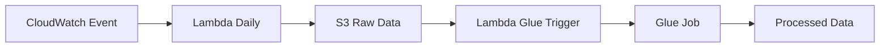

# 📊 Bovespa Data Batch Pipeline

> Pipeline de dados em lote para coleta e processamento de dados da Bovespa usando AWS

---

## 🏗️ Arquitetura da Infraestrutura

### 📁 Estrutura Modular

```
IaC/
├── modules/
│   ├── s3/          # Buckets S3 (state, datalake, scripts)
│   ├── lambda/      # Funções Lambda (coleta e trigger)
│   ├── glue/        # Job de processamento Glue
│   ├── iam/         # Roles e políticas IAM
│   └── cloudwatch/  # Agendamento de eventos
├── main.tf          # Orquestração dos módulos
├── variables.tf     # Variáveis globais
└── version.tf       # Backend e providers
```

### 🔧 Componentes AWS


| Módulo        | Recursos                        | Descrição                |
| -------------- | ------------------------------- | -------------------------- |
| **S3**         | State bucket, Datalake, Scripts | Armazenamento distribuído |
| **Lambda**     | Daily collector, Glue trigger   | Funções serverless       |
| **Glue**       | Processing job                  | Transformação de dados   |
| **CloudWatch** | Event rule                      | Agendamento (12:00 UTC)    |
| **IAM**        | Service roles                   | Permissões granulares     |

### 🔄 Fluxo de Dados



1. **⏰ Agendamento**: CloudWatch Event dispara diariamente às 12:00 UTC
2. **📥 Coleta**: Lambda executa e coleta dados da Bovespa
3. **💾 Armazenamento**: Dados salvos no S3 (pasta `raw/`)
4. **🚀 Trigger**: S3 event ativa Lambda de processamento
5. **⚙️ Transformação**: Glue processa arquivos `.parquet`

---

## ⚙️ Configuração e Deploy

### 📋 Pré-requisitos

#### 1. 🐳 Docker

O Docker é necessário para criar o layer das dependências Python para as funções Lambda.

**📥 Instalação por Sistema Operacional:**

- **🐧 Linux (Ubuntu)**: [Guia Oficial](https://docs.docker.com/engine/install/ubuntu/)
- **🪟 Windows**: [Docker Desktop](https://docs.docker.com/desktop/setup/install/windows-install/)
- **🔧 WSL**: [Guia Completo](https://medium.com/@habbema/guia-de-instala%C3%A7%C3%A3o-do-docker-no-wsl-2-com-ubuntu-22-04-9ceabe4d79e8)
- **🍎 macOS**: [Docker Desktop](https://docs.docker.com/desktop/setup/install/mac-install/)

**✅ Verificação:**

```bash
docker --version
```

#### 2. 📦 Criação do Layer Lambda

Antes do deploy, você deve criar o arquivo ZIP com as dependências Python:

```bash
# 1. Construir a imagem Docker com as dependências
docker build -t lambda-layers-builder -f docker/Dockerfile .

# 2. Criar um container temporário (sem executá-lo)
docker create --name extract lambda-layers-builder bash

# 3. Copiar o arquivo ZIP do container para o projeto
docker cp extract:/layer_env.zip ./lambda-layers/layer_env.zip

# 4. Remover o container temporário
docker rm extract
```

**📝 Explicação dos Comandos:**

- `docker build`: Constrói uma imagem contendo todas as dependências Python necessárias
- `docker create`: Cria um container sem iniciá-lo, permitindo acesso aos arquivos
- `docker cp`: Copia o arquivo ZIP gerado do container para o diretório local
- `docker rm`: Remove o container temporário para limpeza

#### 3. 🔐 Credenciais AWS

Configure suas credenciais no arquivo `~/.aws/credentials`:

```ini
[default]
aws_access_key_id = <sua_access_key>
aws_secret_access_key = <sua_secret_key>
aws_session_token = <seu_session_token>  # Se usando sessão temporária
```

#### 2. 🪣 State Bucket (OBRIGATÓRIO)

**⚠️ IMPORTANTE**: Antes de executar `terraform init`, você deve:

1. Criar manualmente um bucket S3 para o estado do Terraform
2. Alterar o nome do bucket no arquivo `IaC/version.tf`

```hcl
# IaC/version.tf
backend "s3" {
  bucket = "SEU-BUCKET-TERRAFORM-STATE"  # ← Altere aqui
  key    = "infra/tfstate_file.tfstate"
  region = "us-east-1"
}
```

### 🛠️ Configuração de Variáveis

#### Variáveis de Ambiente (Alternativa)

```bash
export TF_VAR_name_role_daily_lambda_bovespa="" # nome da role
export TF_VAR_create_new_role_lambda_glue_activation="" # true ou false
export TF_VAR_name_role_lambda_glue_activation="" # nome da role
export TF_VAR_create_new_glue_job="" # true ou false
export TF_VAR_name_glue_job="" # nome da role
export TF_VAR_create_new_role_glue_job="" # true ou false
export TF_VAR_name_glue_job_role="" # nome da role```
```

### 🚀 Deploy da Infraestrutura

```bash
# 1. Navegar para o diretório
cd IaC

# 2. Inicializar Terraform
terraform init

# 3. Planejar mudanças
terraform plan

# 4. Aplicar infraestrutura
terraform apply
```

---

## 🔧 Instalação do Terraform

### 🪟 Windows

1. **📥 Download**

   - Acesse: https://www.terraform.io/downloads
   - Baixe o arquivo ZIP para Windows
2. **⚙️ Instalação**

   ```cmd
   # Extrair terraform.exe para C:\terraform
   # Adicionar C:\terraform ao PATH do sistema
   ```
3. **✅ Verificação**

   ```cmd
   terraform --version
   ```

### 🐧 Linux

**Ubuntu/Debian:**

```bash
wget -O- https://apt.releases.hashicorp.com/gpg | sudo gpg --dearmor -o /usr/share/keyrings/hashicorp-archive-keyring.gpg
echo "deb [signed-by=/usr/share/keyrings/hashicorp-archive-keyring.gpg] https://apt.releases.hashicorp.com $(lsb_release -cs) main" | sudo tee /etc/apt/sources.list.d/hashicorp.list
sudo apt update && sudo apt install terraform
```

```**✅ Verificação:**

```bash
terraform --version
```
---

## 📚 Recursos Úteis

- 📖 [Documentação Oficial do Terraform](https://developer.hashicorp.com/terraform/tutorials/aws-get-started/install-cli)
- 🏗️ [AWS Provider Documentation](https://registry.terraform.io/providers/hashicorp/aws/latest/docs)
- 📊 [Bovespa API Documentation](https://www.b3.com.br/pt_br/market-data-e-indices/)
